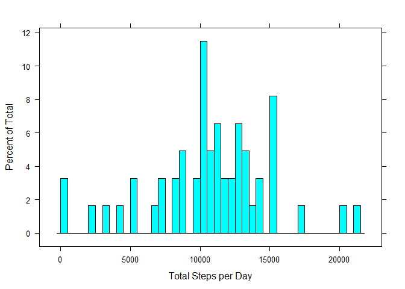
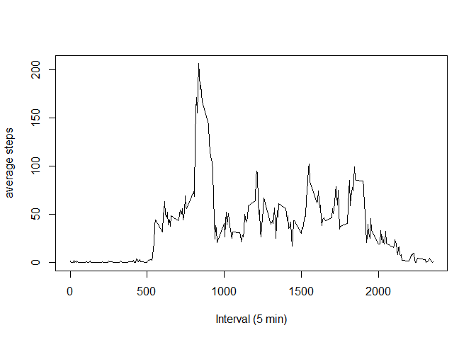
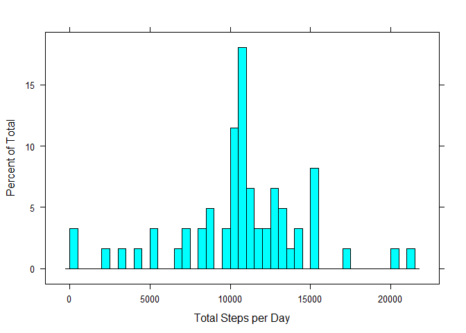
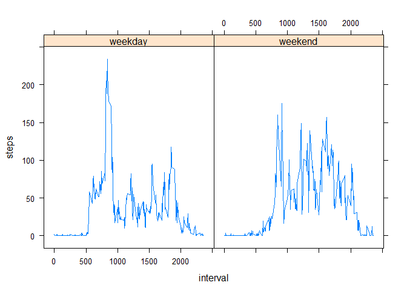

## Loading and preprocessing the data


```r
data<-read.csv("activity.csv")

library(lattice)
```

## What is mean total number of steps taken per day?

1. Calculate the total number of steps taken per day
-I assumed the NA values were not removed based on the following questions.


```r
total.steps.per.day<- aggregate(steps ~ date, data, sum, na.action = na.pass)
```
2. Make a histogram of the total number of steps taken each day


```r
histogram(~steps, data= total.steps.per.day, breaks = length(total.steps.per.day$date), xlab = "Total Steps per Day")
```

<!-- -->
 3. Calculate and report the mean and median of the total number of steps taken per day
 

```r
mean(na.omit(total.steps.per.day$steps))
```

```
## [1] 10766.19
```

```r
median(na.omit(total.steps.per.day$steps))
```

```
## [1] 10765
```

## What is the average daily activity pattern?
1. Make a time series plot (i.e. type="l") of the 5-minute interval (x-axis) and the average number of steps taken, averaged across all days (y-axis)


```r
steps.interval<-aggregate(steps~interval,data=data,mean)

plot(steps.interval$interval, steps.interval$steps, type = "l", xlab = "Interval (5 min)" , ylab = "average steps")
```

<!-- -->
2. Which 5-minute interval, on average across all the days in the dataset, contains the maximum number of steps?


```r
subsetinterval<- steps.interval[steps.interval$steps== max(steps.interval$steps),]

subsetinterval$interval
```

```
## [1] 835
```

## Imputing missing values
1. Calculate and report the total number of missing values in the dataset (i.e. the total number of rows with NAs)


```r
sum(is.na(data))
```

```
## [1] 2304
```
2. Devise a strategy for filling in all of the missing values in the dataset.The strategy does not need to be sophisticated. For example, you could use the mean/median for that day, or the mean for that 5-minute interval, etc.
- All NA values are represent a day that is missing all data.


```r
aggregate(is.na(steps) ~ date, data, sum)
```

```
##          date is.na(steps)
## 1  2012-10-01          288
## 2  2012-10-02            0
## 3  2012-10-03            0
## 4  2012-10-04            0
## 5  2012-10-05            0
## 6  2012-10-06            0
## 7  2012-10-07            0
## 8  2012-10-08          288
## 9  2012-10-09            0
## 10 2012-10-10            0
## 11 2012-10-11            0
## 12 2012-10-12            0
## 13 2012-10-13            0
## 14 2012-10-14            0
## 15 2012-10-15            0
## 16 2012-10-16            0
## 17 2012-10-17            0
## 18 2012-10-18            0
## 19 2012-10-19            0
## 20 2012-10-20            0
## 21 2012-10-21            0
## 22 2012-10-22            0
## 23 2012-10-23            0
## 24 2012-10-24            0
## 25 2012-10-25            0
## 26 2012-10-26            0
## 27 2012-10-27            0
## 28 2012-10-28            0
## 29 2012-10-29            0
## 30 2012-10-30            0
## 31 2012-10-31            0
## 32 2012-11-01          288
## 33 2012-11-02            0
## 34 2012-11-03            0
## 35 2012-11-04          288
## 36 2012-11-05            0
## 37 2012-11-06            0
## 38 2012-11-07            0
## 39 2012-11-08            0
## 40 2012-11-09          288
## 41 2012-11-10          288
## 42 2012-11-11            0
## 43 2012-11-12            0
## 44 2012-11-13            0
## 45 2012-11-14          288
## 46 2012-11-15            0
## 47 2012-11-16            0
## 48 2012-11-17            0
## 49 2012-11-18            0
## 50 2012-11-19            0
## 51 2012-11-20            0
## 52 2012-11-21            0
## 53 2012-11-22            0
## 54 2012-11-23            0
## 55 2012-11-24            0
## 56 2012-11-25            0
## 57 2012-11-26            0
## 58 2012-11-27            0
## 59 2012-11-28            0
## 60 2012-11-29            0
## 61 2012-11-30          288
```
- in the "steps" column we can write a program to just replace those NAs with the mean.
3. Create a new dataset that is equal to the original dataset but with the missing data filled in.


```r
total.without.NAs <- total.steps.per.day
total.without.NAs[is.na(total.without.NAs$steps), "steps"] <- mean(na.omit(total.steps.per.day$steps))
summary(total.without.NAs)
```

```
##          date        steps      
##  2012-10-01: 1   Min.   :   41  
##  2012-10-02: 1   1st Qu.: 9819  
##  2012-10-03: 1   Median :10766  
##  2012-10-04: 1   Mean   :10766  
##  2012-10-05: 1   3rd Qu.:12811  
##  2012-10-06: 1   Max.   :21194  
##  (Other)   :55
```
4. Make a histogram of the total number of steps taken each day.


```r
histogram(~steps, data= total.without.NAs, breaks = length(total.without.NAs$date), xlab = "Total Steps per Day")
```

<!-- -->

and Calculate and report the mean and median total number of steps taken per day.  


```r
mean(total.without.NAs$steps)
```

```
## [1] 10766.19
```

```r
median(total.without.NAs$steps)
```

```
## [1] 10766.19
```
Do these values differ from the estimates from the first part of the assignment? No


```r
values<- matrix(c(mean(na.omit(total.steps.per.day$steps)),
mean(total.without.NAs$steps),median(na.omit(total.steps.per.day$steps)),median(total.without.NAs$steps)))

rownames(values)<- c("mean1", "mean2", "median1", "median2")
```

What is the impact of imputing missing data on the estimates of the total daily number of steps? 1st and 3rd Quarter values change.

```r
summary(total.steps.per.day); summary(total.without.NAs)
```

```
##          date        steps      
##  2012-10-01: 1   Min.   :   41  
##  2012-10-02: 1   1st Qu.: 8841  
##  2012-10-03: 1   Median :10765  
##  2012-10-04: 1   Mean   :10766  
##  2012-10-05: 1   3rd Qu.:13294  
##  2012-10-06: 1   Max.   :21194  
##  (Other)   :55   NA's   :8
```

```
##          date        steps      
##  2012-10-01: 1   Min.   :   41  
##  2012-10-02: 1   1st Qu.: 9819  
##  2012-10-03: 1   Median :10766  
##  2012-10-04: 1   Mean   :10766  
##  2012-10-05: 1   3rd Qu.:12811  
##  2012-10-06: 1   Max.   :21194  
##  (Other)   :55
```
## Are there differences in activity patterns between weekdays and weekends?

1. Create a new factor variable in the dataset with two levels - "weekday" and "weekend" indicating whether a given date is a weekday or weekend day.

```r
data$date<- as.Date(data$date)

data$week<- weekdays.Date(data$date)

data$weekType<- as.factor(ifelse(data$week == "Sunday" | data$week == "Saturday", "weekend", "weekday"))


steps.interval2<- aggregate(steps~interval+weekType,data=data,mean)
```

2.Make a panel plot containing a time series plot (i.e. type = "l") of the 5-minute interval (x-axis) and the average number of steps taken, averaged across all weekday days or weekend days (y-axis).


```r
xyplot(steps ~ interval | weekType, data= steps.interval2, type = "l")
```

<!-- -->
